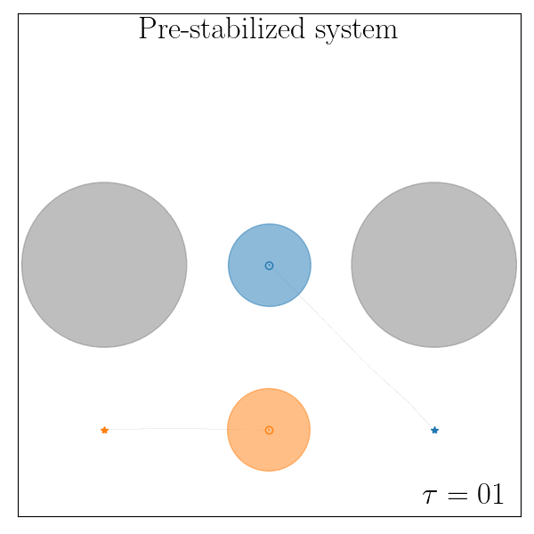

# Boosting the performance of nonlinear systems through NN-based output-feedback controllers


PyTorch implementation of our NN-based control framework presented in the   
paper titled "Parametrizations of All Stable Closed-Loop Responses: from
    Theory to Neural Network Control Design"


## Installation

```bash
git clone https://github.com/DecodEPFL/outputSLS.git

cd outputSLS

python setup.py install
```

 

## Examples: 

The environment consists of two robots that need to achieve some predefined task while avoiding collisions 
between them and the obstacles.
In the first case, the robots need to pass through a narrow corridor, while in the second
case they have to visit different goals in a predefined order.

### Mountains

The following gifs show the trajectories of the 2 robots before training (left), and after the training 
of the proposed controller (right). 
The agents need to coordinate in order to pass through a narrow passage while avoiding collisions between them. 
The initial conditions used as training data are marked with &#9675;, consisting of s = 100 samples.
The shown trajectories start from a random initial position sampled from the test data and marked with &#9675;.

<p align="center">


</p> 

### Waypoint-tracking 

The following gifs show the trajectories of the 2 robots before training (left), and after the training 
of the proposed controller (right). 
The agents need to visit different waypoints in a specific order.

<p align="center">


</p> 


## License
This work is licensed under a
[Creative Commons Attribution 4.0 International License][cc-by].

[![CC BY 4.0][cc-by-image]][cc-by] 

[cc-by]: http://creativecommons.org/licenses/by/4.0/
[cc-by-image]: https://i.creativecommons.org/l/by/4.0/88x31.png
[cc-by-shield]: https://img.shields.io/badge/License-CC%20BY%204.0-lightgrey.svg


## References
[1] Clara Galimberti, Luca Furieri, Giancarlo Ferrari-Trecate.
"Parametrizations of All Stable Closed-Loop Responses: from Theory to Neural Network Control Design," 2024.
